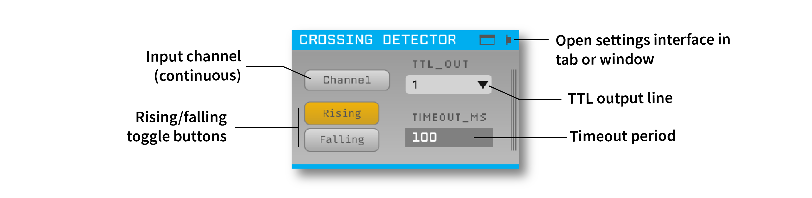
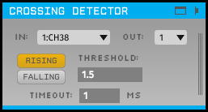
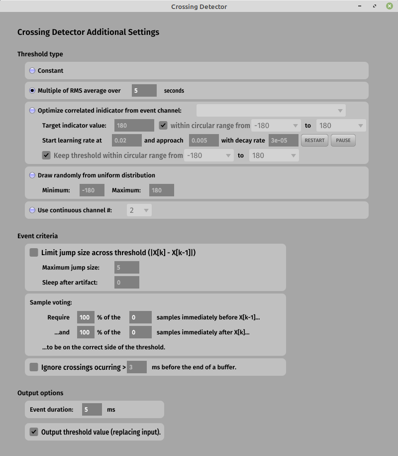

# Crossing Detector [](https://zenodo.org/badge/latestdoi/98764510)



Emits a TTL event when a continuous channel crosses a specified threshold level. Each Crossing Detector can only process one input channel at a time, but multiple detectors can be placed in series to trigger on as many channels as desired.

 

This plugin can be added via the Open Ephys GUI Plugin Installer. To access the Plugin Installer, press **ctrl-P** or **⌘P** from inside the GUI. Once the installer is loaded, browse to the "Crossing Detector" plugin and click "Install."

## Usage

### Plugin Editor

* When the **Channel** that is selected **Rises** and/or **Falls** across the threshold level (specified in the visualizer window), an event is triggered on the `TTL_OUT` line.

* `TIMEOUT_MS` controls the minimum time between two consecutive events (i.e. for this number of milliseconds after an event fires, no more crossings can be detected).

### Visualizer Window

* #### Threshold type:
  * **Constant** (default) - the threshold is a constant value.

  * **Random** - the plugin randomly chooses a new threshold for each event, based on a uniform distribution

  * **Continuous channel** - the input channel is compared with a second continuous channel on a sample-by-sample basis, to allow the threshold to change dynamically

* #### Event criteria:

  * Cross-threshold jump size limit (does not fire an event if the difference across threshold is too large in magnitude; useful for filtering out wrapped phase jumps, for example)

  * Sample voting (make detection more robust to noise by requiring a larger span of samples before or after t0 to be on the correct side)

  * Ignore crossings at the end of a buffer

* Event duration (in ms) - the delay until the "OFF" event after an "ON" event is triggered

## Building from source

First, follow the instructions on [this page](https://open-ephys.github.io/gui-docs/Developer-Guide/Compiling-the-GUI.html) to build the Open Ephys GUI.

**Important:** This plugin is intended for use with the latest version of the GUI (0.6.0 and higher). The GUI should be compiled from the [`main`](https://github.com/open-ephys/plugin-gui/tree/main) branch, rather than the former `master` branch.

Then, clone this repository into a directory at the same level as the `plugin-GUI`, e.g.:
 
```
Code
├── plugin-GUI
│   ├── Build
│   ├── Source
│   └── ...
├── OEPlugins
│   └── crossing-detector
│       ├── Build
│       ├── Source
│       └── ...
```

### Windows

**Requirements:** [Visual Studio](https://visualstudio.microsoft.com/) and [CMake](https://cmake.org/install/)

From the `Build` directory, enter:

```bash
cmake -G "Visual Studio 17 2022" -A x64 ..
```

Next, launch Visual Studio and open the `OE_PLUGIN_crossing-detector.sln` file that was just created. Select the appropriate configuration (Debug/Release) and build the solution.

Selecting the `INSTALL` project and manually building it will copy the `.dll` and any other required files into the GUI's `plugins` directory. The next time you launch the GUI from Visual Studio, the Crossing Detector plugin should be available.


### Linux

**Requirements:** [CMake](https://cmake.org/install/)

From the `Build` directory, enter:

```bash
cmake -G "Unix Makefiles" ..
cd Debug
make -j
make install
```

This will build the plugin and copy the `.so` file into the GUI's `plugins` directory. The next time you launch the compiled version of the GUI, the Crossing Detector plugin should be available.


### macOS

**Requirements:** [Xcode](https://developer.apple.com/xcode/) and [CMake](https://cmake.org/install/)

From the `Build` directory, enter:

```bash
cmake -G "Xcode" ..
```

Next, launch Xcode and open the `crossing-detector.xcodeproj` file that now lives in the “Build” directory.

Running the `ALL_BUILD` scheme will compile the plugin; running the `INSTALL` scheme will install the `.bundle` file to `/Users/<username>/Library/Application Support/open-ephys/plugins-api`. The Crossing Detector plugin should be available the next time you launch the GUI from Xcode.

## Attribution

This plugin was originally developed by Ethan Blackwood and Mark Schatza in the Translational NeuroEngineering lab at the University of Minnesota. It is now being maintained by the Allen Institute.
