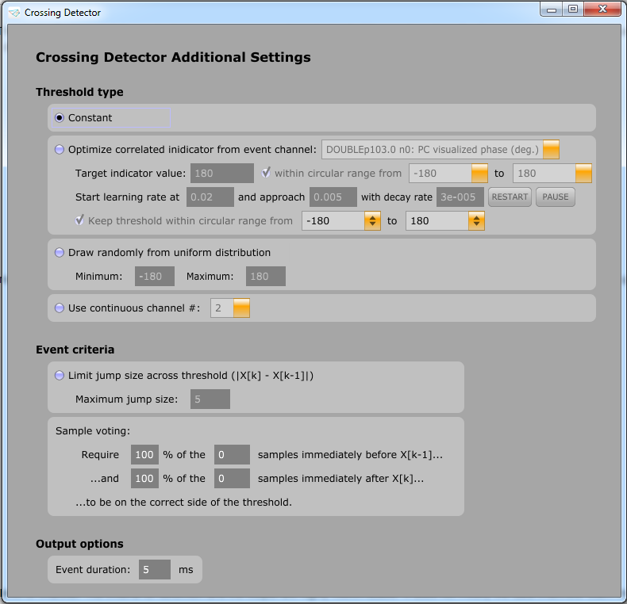

# Crossing Detector Plugin

This plugin for the [Open Ephys GUI](https://github.com/open-ephys/plugin-GUI) fires a TTL event when a specified input data channel crosses a specified threshold level; the criteria for detection and the output are highly customizable. It does not modify the data channels. Each instance only processes one data channel, but multiple instances can be chained together or placed in parallel.

 

## Settings:

### Main panel

* Basic operation: When the __In__ data channel __Rises__ and/or __Falls__ across the __Threshold__ level, an event turns on on the __Out__ event channel.

* __Timeout__ controls the minimum time between two consecutive events (i.e. for this number of milliseconds after an event fires, no more crossings can be detected).

### Additional settings (in visualizer window)

* #### Threshold type:
  * Constant is the default.

  * "Optimize correlated indicator from event channel" (adaptive): This allows you to use a simple optimization algorithm to automatically adjust the threshold. Given a *binary* event channel, it assumes that the values of events from this channel are correlated with the threshold, and adjusts the threshold according to the learning rate to try to move the event values closer to the specified target. See the tooltips on each setting for more information.

  * Random (chooses a new threshold for each event, uniformly at random within the provided range)

  * Continuous channel (compared with the input channel sample-by-sample to identify crossings)

* #### Event criteria:

  * Cross-threshold jump size limit (does not fire an event if the difference across threshold is too large in magnitude; useful for filtering out wrapped phase jumps, for example)

  * Sample voting (make detection more robust to noise by requiring a larger span of samples before or after t0 to be on the correct side)

* Event duration (in ms)

## Installation

The crossing detector has been compiled and tested on Windows and Linux, but currently not on OSX. It shouldn't be too hard to get it working though, since it's a standard plugin that requires no external libraries. Let me know if you're interested in porting it - or just go ahead and do it.

On all platforms:

* Copy `crossing-detector/Source/CrossingDetector` to `plugin-GUI/Source/Plugins/CrossingDetector`.

On Windows (VS2013):

* Copy `crossing-detector/Builds/VisualStudio2013/CrossingDetector` to `plugin-GUI/Builds/VisualStudio2013/Plugins/CrossingDetector`.

* In Visual Studio, open the `Plugins.sln` solution and add the new project (`File->Add->Existing Project...` and select `Builds/VisualStudio2013/Plugins/CrossingDetector/CrossingDetector.vcxproj`). Then build the solution.

I hope you find this to be useful!
-Ethan Blackwood ([ethanbb](https://github.com/ethanbb))
