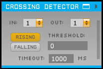
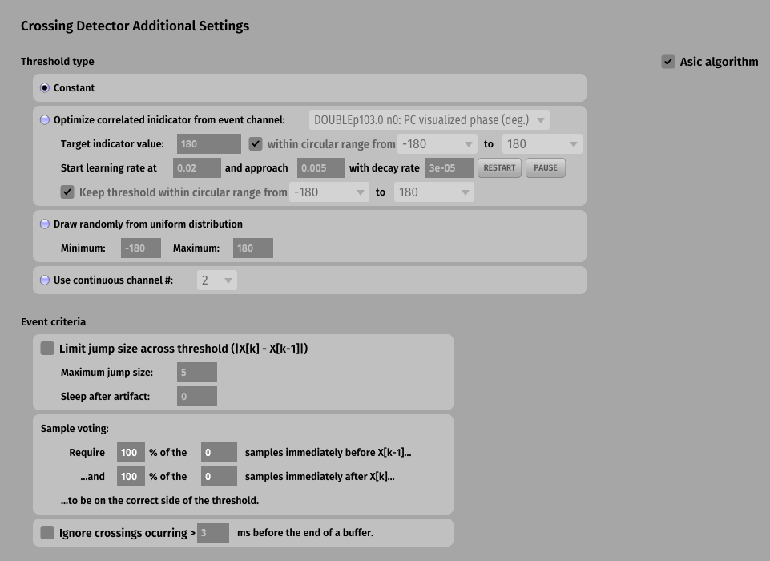

# Crossing Detector Plugin 

This plugin for the [Open Ephys GUI](https://github.com/open-ephys/plugin-GUI) fires a TTL event when a specified input data channel crosses a specified threshold level; the criteria for detection and the output are highly customizable. It does not modify the data channels. Each instance only processes one data channel, but multiple instances can be chained together or placed in parallel.

Cite this code using the DOI above!

 

## Settings:

### Main panel

* Basic operation: When the __In__ data channel __Rises__ and/or __Falls__ across the __Threshold__ level, an event turns on on the __Out__ event channel.

* __Timeout__ controls the minimum time between two consecutive events (i.e. for this number of milliseconds after an event fires, no more crossings can be detected).

### Additional settings (in visualizer window)

* #### Threshold type:
  * Constant is the default.

  * "Optimize correlated indicator from event channel" (adaptive): This allows you to use a simple optimization algorithm to automatically adjust the threshold. Given a *binary* event channel, it assumes that the values of events from this channel are correlated with the threshold, and adjusts the threshold according to the learning rate to try to move the event values closer to the specified target. See the tooltips on each setting for more information.

  * Random (chooses a new threshold for each event, uniformly at random within the provided range)

  * Continuous channel (compared with the input channel sample-by-sample to identify crossings)

* #### Event criteria:

  * Cross-threshold jump size limit (does not fire an event if the difference across threshold is too large in magnitude; useful for filtering out wrapped phase jumps, for example)

  * Sample voting (make detection more robust to noise by requiring a larger span of samples before or after t0 to be on the correct side)

* Event duration (in ms)

## Installation using CMake

This plugin can now be built outside of the main GUI file tree using CMake. In order to do so, it must be in a sibling directory to plugin-GUI\* and the main GUI must have already been compiled.

You should use this branch if you are already using CMake to build the *main GUI* (in development as of writing). Otherwise, use the `master` branch.

See `CrossingDetector/CMAKE_README.txt` and/or the wiki page [here](https://open-ephys.atlassian.net/wiki/spaces/OEW/pages/1259110401/Plugin+CMake+Builds) for build instructions.

\* If you have the GUI built somewhere else, you can specify its location by setting the environment variable `GUI_BASE_DIR` or defining it when calling cmake with the option `-DGUI_BASE_DIR=<location>`.

Currently maintained by Sumedh Sopan Nagrale. 

## Crossing Detector version
	This version includes an additional constraint which is activated by clicking on asic checkbox which is on the upper right side. 
	This leads the algorithm to check if the current and previous phases does not have a improbable difference.
	if current value was 45 and the next value was above 135, the stimulation will not occur.